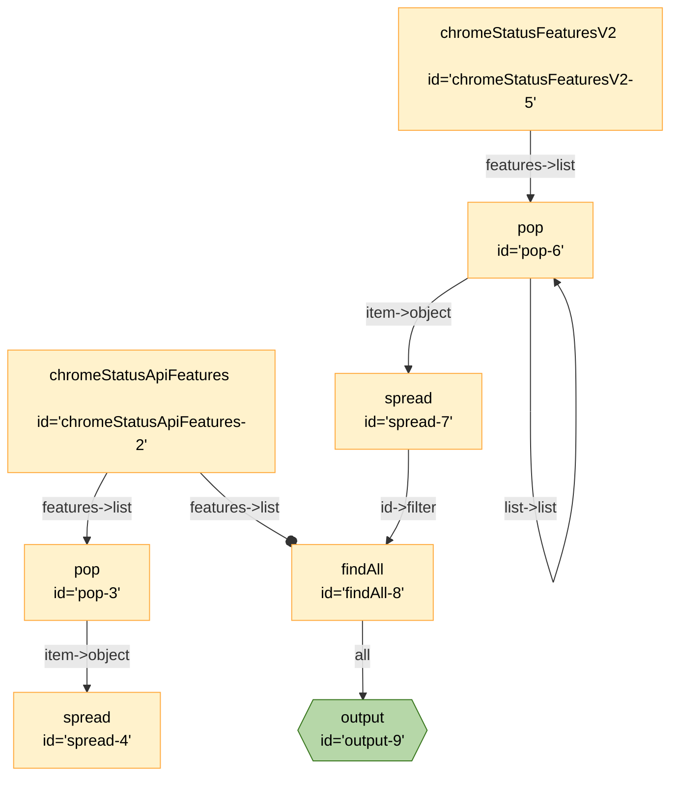

# DevPulse



```json
{
	"title": "AutoBake",
	"edges": [
		{
			"from": "chromeStatusApiFeatures-2",
			"to": "pop-3",
			"out": "features",
			"in": "list"
		},
		{
			"from": "pop-3",
			"to": "spread-4",
			"out": "item",
			"in": "object"
		},
		{
			"from": "chromeStatusFeaturesV2-5",
			"to": "pop-6",
			"out": "features",
			"in": "list"
		},
		{
			"from": "pop-6",
			"to": "spread-7",
			"out": "item",
			"in": "object"
		},
		{
			"from": "pop-6",
			"to": "pop-6",
			"out": "list",
			"in": "list"
		},
		{
			"from": "chromeStatusApiFeatures-2",
			"to": "findAll-8",
			"constant": true,
			"out": "features",
			"in": "list"
		},
		{
			"from": "spread-7",
			"to": "findAll-8",
			"out": "id",
			"in": "filter"
		},
		{
			"from": "findAll-8",
			"to": "output-9",
			"out": "*"
		}
	],
	"nodes": [
		{
			"id": "versions-1",
			"type": "versions"
		},
		{
			"id": "chromeStatusApiFeatures-2",
			"type": "chromeStatusApiFeatures"
		},
		{
			"id": "pop-3",
			"type": "pop"
		},
		{
			"id": "spread-4",
			"type": "spread"
		},
		{
			"id": "chromeStatusFeaturesV2-5",
			"type": "chromeStatusFeaturesV2"
		},
		{
			"id": "pop-6",
			"type": "pop"
		},
		{
			"id": "spread-7",
			"type": "spread"
		},
		{
			"id": "findAll-8",
			"type": "findAll",
			"configuration": {
				"field": "id"
			}
		},
		{
			"id": "output-9",
			"type": "output"
		}
	],
	"kits": [
		{
			"url": "npm:@exadev/breadboard-kits/chrome-status"
		},
		{
			"url": "npm:@exadev/breadboard-kits/array-filter"
		},
		{
			"url": "npm:@exadev/breadboard-kits/list"
		},
		{
			"url": "npm:@exadev/filterKit"
		},
		{
			"url": "npm:@exadev/breadboard-kits/kits/ObjectKit"
		}
	]
}
```