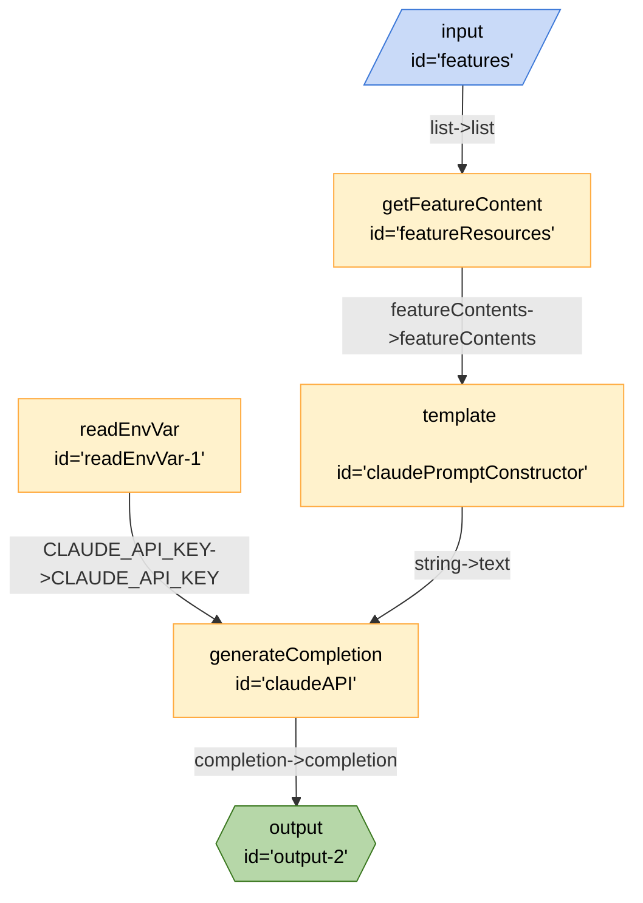

# AutoBake



```json
{
	"title": "AutoBake",
	"edges": [
		{
			"from": "features",
			"to": "featureResources",
			"out": "list",
			"in": "list"
		},
		{
			"from": "featureResources",
			"to": "claudePromptConstructor",
			"out": "featureContents",
			"in": "featureContents"
		},
		{
			"from": "readEnvVar-1",
			"to": "claudeAPI",
			"out": "CLAUDE_API_KEY",
			"in": "CLAUDE_API_KEY"
		},
		{
			"from": "claudePromptConstructor",
			"to": "claudeAPI",
			"out": "string",
			"in": "text"
		},
		{
			"from": "claudeAPI",
			"to": "output-2",
			"out": "completion",
			"in": "completion"
		}
	],
	"nodes": [
		{
			"id": "features",
			"type": "input",
			"configuration": {
				"schema": {
					"type": "object",
					"properties": {
						"text": {
							"type": "list",
							"title": "Text",
							"description": "urls"
						}
					}
				}
			}
		},
		{
			"id": "featureResources",
			"type": "getFeatureContent"
		},
		{
			"id": "claudeAPI",
			"type": "generateCompletion",
			"configuration": {
				"model": "claude-2",
				"url": "https://api.anthropic.com/v1/complete"
			}
		},
		{
			"id": "claudePromptConstructor",
			"type": "template",
			"configuration": {
				"template": "Based on these documents, give me a script that can be used to teach a junior developer about the discussed topic in the document, output in markdown format?:/n{{featureContents}}"
			}
		},
		{
			"id": "readEnvVar-1",
			"type": "readEnvVar",
			"configuration": {
				"key": "CLAUDE_API_KEY"
			}
		},
		{
			"id": "output-2",
			"type": "output"
		}
	],
	"kits": [
		{
			"url": "npm@exadev/breadboard-kits/featureKit"
		},
		{
			"url": "npm:@paulkinlan/claude-breadboard-kit"
		},
		{
			"url": "npm:@exadev/breadboard-kits/kits/StringKit"
		},
		{
			"url": "npm:@exadev/breadboard-kits/kits/ConfigKit"
		}
	]
}
```