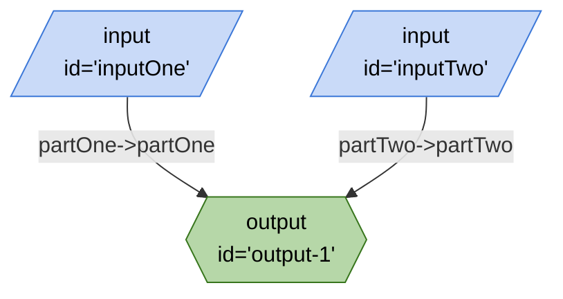

# multiple-inputs-one-output.ts

## Mermaid


## JSON
```json
{
	"title": "multiple-inputs-one-output.ts",
	"edges": [
		{
			"from": "inputOne",
			"to": "output-1",
			"out": "partOne",
			"in": "partOne"
		},
		{
			"from": "inputTwo",
			"to": "output-1",
			"out": "partTwo",
			"in": "partTwo"
		}
	],
	"nodes": [
		{
			"id": "output-1",
			"type": "output"
		},
		{
			"id": "inputOne",
			"type": "input"
		},
		{
			"id": "inputTwo",
			"type": "input"
		}
	],
	"kits": []
}
```