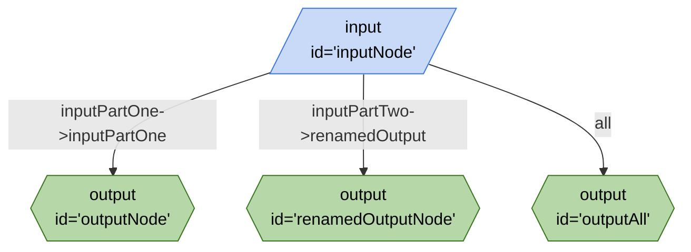

# naming-wiring-parameters.ts



```json
{
	"title": "naming-wiring-parameters.ts",
	"edges": [
		{
			"from": "inputNode",
			"to": "outputNode",
			"out": "inputPartOne",
			"in": "inputPartOne"
		},
		{
			"from": "inputNode",
			"to": "renamedOutputNode",
			"out": "inputPartTwo",
			"in": "renamedOutput"
		},
		{
			"from": "inputNode",
			"to": "outputAll",
			"out": "*"
		}
	],
	"nodes": [
		{
			"id": "inputNode",
			"type": "input"
		},
		{
			"id": "outputNode",
			"type": "output"
		},
		{
			"id": "renamedOutputNode",
			"type": "output"
		},
		{
			"id": "outputAll",
			"type": "output"
		}
	],
	"kits": [
		{
			"url": "npm:@google-labs/core-kit"
		}
	]
}
```