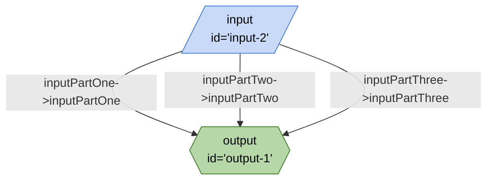

# Arrow Directions



```json
{
	"title": "Arrow Directions",
	"edges": [
		{
			"from": "input-2",
			"to": "output-1",
			"out": "inputPartOne",
			"in": "inputPartOne"
		},
		{
			"from": "input-2",
			"to": "output-1",
			"out": "inputPartTwo",
			"in": "inputPartTwo"
		},
		{
			"from": "input-2",
			"to": "output-1",
			"out": "inputPartThree",
			"in": "inputPartThree"
		}
	],
	"nodes": [
		{
			"id": "output-1",
			"type": "output"
		},
		{
			"id": "input-2",
			"type": "input"
		}
	],
	"kits": []
}
```