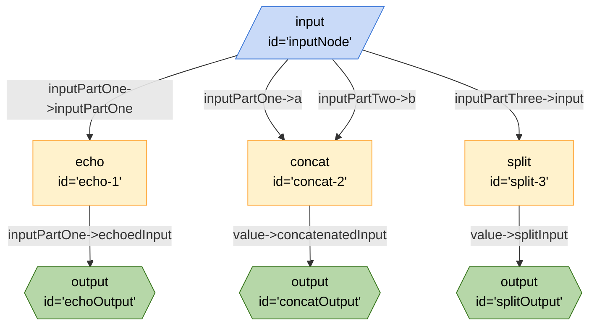

# Custom Kit Node Values and Handlers Demo



```json
{
	"title": "Custom Kit Node Values and Handlers Demo",
	"edges": [
		{
			"from": "inputNode",
			"to": "echo-1",
			"out": "inputPartOne",
			"in": "inputPartOne"
		},
		{
			"from": "echo-1",
			"to": "echoOutput",
			"out": "inputPartOne",
			"in": "echoedInput"
		},
		{
			"from": "inputNode",
			"to": "concat-2",
			"out": "inputPartOne",
			"in": "a"
		},
		{
			"from": "inputNode",
			"to": "concat-2",
			"out": "inputPartTwo",
			"in": "b"
		},
		{
			"from": "concat-2",
			"to": "concatOutput",
			"out": "value",
			"in": "concatenatedInput"
		},
		{
			"from": "inputNode",
			"to": "split-3",
			"out": "inputPartThree",
			"in": "input"
		},
		{
			"from": "split-3",
			"to": "splitOutput",
			"out": "value",
			"in": "splitInput"
		}
	],
	"nodes": [
		{
			"id": "echo-1",
			"type": "echo"
		},
		{
			"id": "concat-2",
			"type": "concat"
		},
		{
			"id": "split-3",
			"type": "split"
		},
		{
			"id": "inputNode",
			"type": "input"
		},
		{
			"id": "echoOutput",
			"type": "output"
		},
		{
			"id": "concatOutput",
			"type": "output"
		},
		{
			"id": "splitOutput",
			"type": "output"
		}
	],
	"kits": [
		{
			"url": "npm:my-custom-kit"
		}
	]
}
```