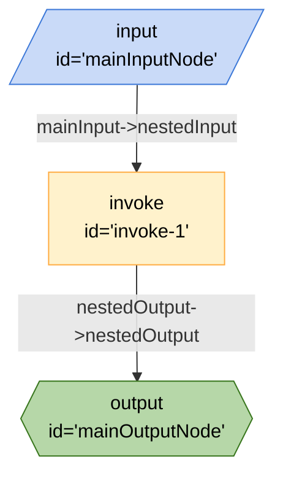

# Include Board as a Node with URL



```json
{
	"title": "Include Board as a Node with URL",
	"edges": [
		{
			"from": "invoke-1",
			"to": "mainOutputNode",
			"out": "nestedOutput",
			"in": "nestedOutput"
		},
		{
			"from": "mainInputNode",
			"to": "invoke-1",
			"out": "mainInput",
			"in": "nestedInput"
		}
	],
	"nodes": [
		{
			"id": "mainInputNode",
			"type": "input"
		},
		{
			"id": "invoke-1",
			"type": "invoke",
			"configuration": {
				"path": "https://raw.githubusercontent.com/ExaDev-io/breadboard-samples/more-demos/samples/Breadboard%20Walkthrough/src/include-board-as-a-node-with-url/nestedboard.json"
			}
		},
		{
			"id": "mainOutputNode",
			"type": "output"
		}
	],
	"kits": [
		{
			"url": "npm:@google-labs/core-kit"
		}
	]
}
```