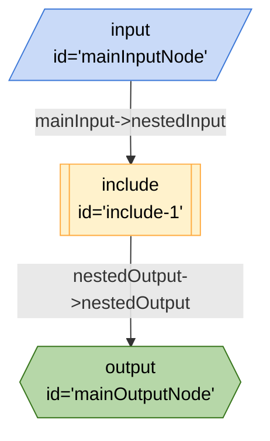

# Include Board as a Node



```json
{
	"title": "Include Board as a Node",
	"edges": [
		{
			"from": "include-1",
			"to": "mainOutputNode",
			"out": "nestedOutput",
			"in": "nestedOutput"
		},
		{
			"from": "mainInputNode",
			"to": "include-1",
			"out": "mainInput",
			"in": "nestedInput"
		}
	],
	"nodes": [
		{
			"id": "mainInputNode",
			"type": "input"
		},
		{
			"id": "include-1",
			"type": "include",
			"configuration": {
				"graph": {
					"title": "Nested Board",
					"edges": [
						{
							"from": "nestedInputNode",
							"to": "nestedOutputNode",
							"out": "nestedInput",
							"in": "nestedOutput"
						}
					],
					"nodes": [
						{
							"id": "nestedInputNode",
							"type": "input"
						},
						{
							"id": "nestedOutputNode",
							"type": "output"
						}
					],
					"kits": []
				}
			}
		},
		{
			"id": "mainOutputNode",
			"type": "output"
		}
	],
	"kits": [
		{
			"url": "npm:@google-labs/core-kit"
		}
	]
}
```