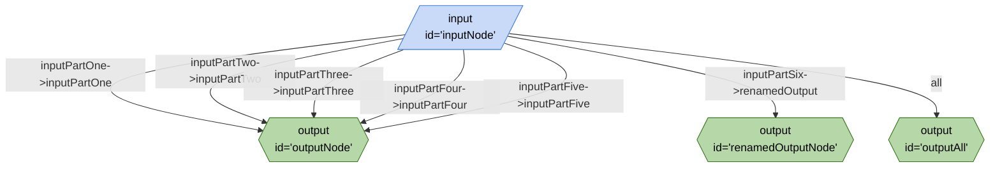

# Naming Wiring Parameters



```json
{
	"title": "Naming Wiring Parameters",
	"edges": [
		{
			"from": "inputNode",
			"to": "outputNode",
			"out": "inputPartOne",
			"in": "inputPartOne"
		},
		{
			"from": "inputNode",
			"to": "outputNode",
			"out": "inputPartTwo",
			"in": "inputPartTwo"
		},
		{
			"from": "inputNode",
			"to": "outputNode",
			"out": "inputPartThree",
			"in": "inputPartThree"
		},
		{
			"from": "inputNode",
			"to": "outputNode",
			"out": "inputPartFour",
			"in": "inputPartFour"
		},
		{
			"from": "inputNode",
			"to": "outputNode",
			"out": "inputPartFive",
			"in": "inputPartFive"
		},
		{
			"from": "inputNode",
			"to": "renamedOutputNode",
			"out": "inputPartSix",
			"in": "renamedOutput"
		},
		{
			"from": "inputNode",
			"to": "outputAll",
			"out": "*"
		}
	],
	"nodes": [
		{
			"id": "inputNode",
			"type": "input"
		},
		{
			"id": "outputNode",
			"type": "output"
		},
		{
			"id": "outputNode",
			"type": "output"
		},
		{
			"id": "outputNode",
			"type": "output"
		},
		{
			"id": "outputNode",
			"type": "output"
		},
		{
			"id": "outputNode",
			"type": "output"
		},
		{
			"id": "renamedOutputNode",
			"type": "output"
		},
		{
			"id": "outputAll",
			"type": "output"
		}
	],
	"kits": []
}
```