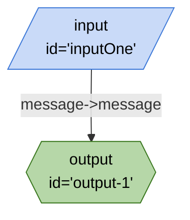

# index.ts



```json
{
	"title": "index.ts",
	"edges": [
		{
			"from": "inputOne",
			"to": "output-1",
			"out": "message",
			"in": "message"
		}
	],
	"nodes": [
		{
			"id": "inputOne",
			"type": "input"
		},
		{
			"id": "output-1",
			"type": "output"
		}
	],
	"kits": []
}
```