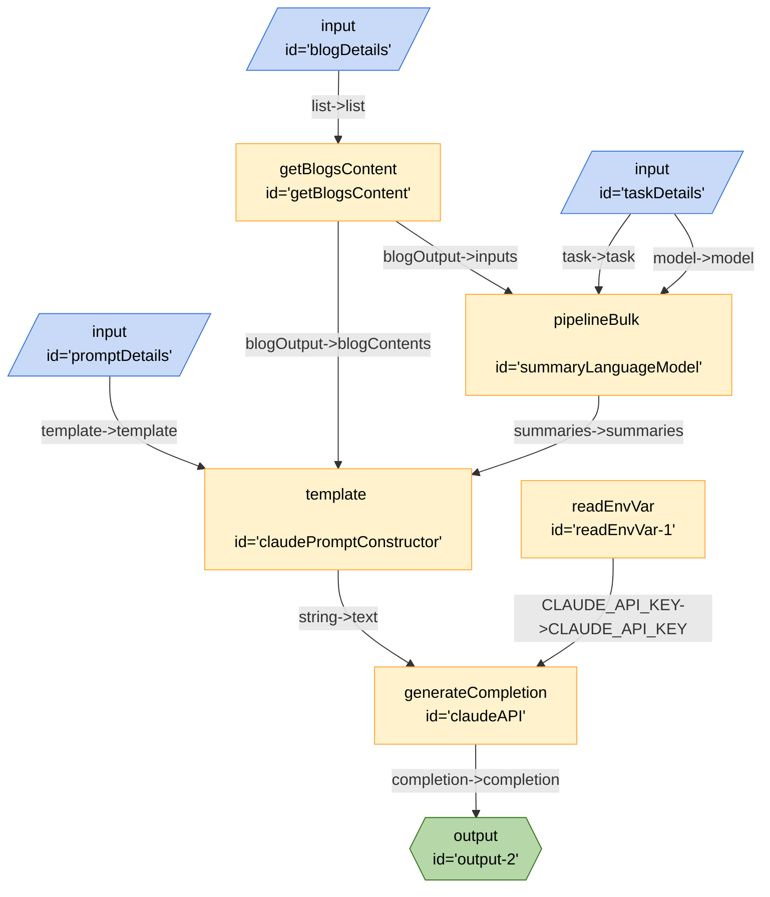

# CourseCrafter



```json
{
	"title": "CourseCrafter",
	"edges": [
		{
			"from": "promptDetails",
			"to": "claudePromptConstructor",
			"out": "template",
			"in": "template"
		},
		{
			"from": "blogDetails",
			"to": "getBlogsContent",
			"out": "list",
			"in": "list"
		},
		{
			"from": "taskDetails",
			"to": "summaryLanguageModel",
			"out": "model",
			"in": "model"
		},
		{
			"from": "taskDetails",
			"to": "summaryLanguageModel",
			"out": "task",
			"in": "task"
		},
		{
			"from": "getBlogsContent",
			"to": "summaryLanguageModel",
			"out": "blogOutput",
			"in": "inputs"
		},
		{
			"from": "getBlogsContent",
			"to": "claudePromptConstructor",
			"out": "blogOutput",
			"in": "blogContents"
		},
		{
			"from": "summaryLanguageModel",
			"to": "claudePromptConstructor",
			"out": "summaries",
			"in": "summaries"
		},
		{
			"from": "readEnvVar-1",
			"to": "claudeAPI",
			"out": "CLAUDE_API_KEY",
			"in": "CLAUDE_API_KEY"
		},
		{
			"from": "claudePromptConstructor",
			"to": "claudeAPI",
			"out": "string",
			"in": "text"
		},
		{
			"from": "claudeAPI",
			"to": "output-2",
			"out": "completion",
			"in": "completion"
		}
	],
	"nodes": [
		{
			"id": "blogDetails",
			"type": "input",
			"configuration": {
				"schema": {
					"type": "object",
					"properties": {
						"text": {
							"type": "list",
							"title": "Text",
							"description": "urls"
						}
					}
				}
			}
		},
		{
			"id": "promptDetails",
			"type": "input",
			"configuration": {
				"schema": {
					"type": "object",
					"properties": {
						"text": {
							"type": "string",
							"title": "Text",
							"description": "urls"
						}
					}
				}
			}
		},
		{
			"id": "taskDetails",
			"type": "input",
			"configuration": {
				"schema": {
					"type": "object",
					"properties": {
						"text": {
							"type": "string",
							"title": "Text",
							"description": "model and task"
						}
					}
				}
			}
		},
		{
			"id": "getBlogsContent",
			"type": "getBlogsContent"
		},
		{
			"id": "summaryLanguageModel",
			"type": "pipelineBulk"
		},
		{
			"id": "claudePromptConstructor",
			"type": "template"
		},
		{
			"id": "claudeAPI",
			"type": "generateCompletion",
			"configuration": {
				"model": "claude-2",
				"url": "https://api.anthropic.com/v1/complete"
			}
		},
		{
			"id": "readEnvVar-1",
			"type": "readEnvVar",
			"configuration": {
				"key": "CLAUDE_API_KEY"
			}
		},
		{
			"id": "output-2",
			"type": "output"
		}
	],
	"kits": [
		{
			"url": "npm@exadev/breadboard-kits/CourseCrafter"
		},
		{
			"url": "npm:@xenova/transformers"
		},
		{
			"url": "npm:@paulkinlan/claude-breadboard-kit"
		},
		{
			"url": "npm:@exadev/breadboard-kits/kits/StringKit"
		},
		{
			"url": "npm:@exadev/breadboard-kits/kits/ConfigKit"
		}
	]
}
```