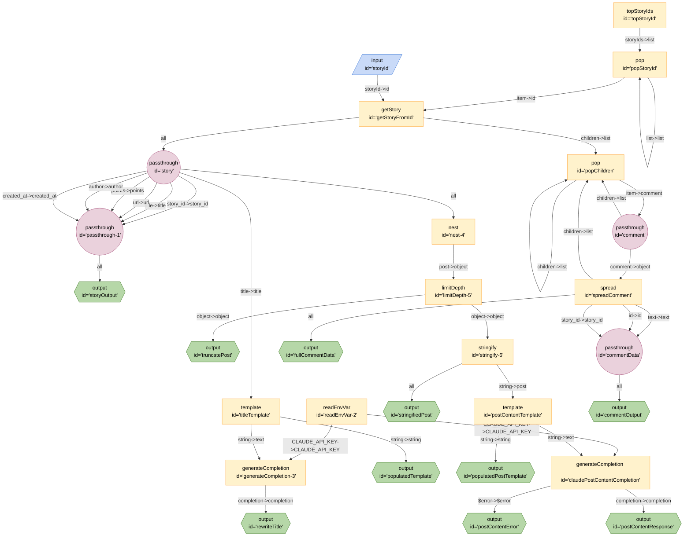

# Hacker News

## Mermaid


## JSON
```json
{
	"title": "Hacker News",
	"edges": [
		{
			"from": "topStoryId",
			"to": "popStoryId",
			"out": "storyIds",
			"in": "list"
		},
		{
			"from": "popStoryId",
			"to": "popStoryId",
			"out": "list",
			"in": "list"
		},
		{
			"from": "popStoryId",
			"to": "getStoryFromId",
			"out": "item",
			"in": "id"
		},
		{
			"from": "storyId",
			"to": "getStoryFromId",
			"out": "storyId",
			"in": "id"
		},
		{
			"from": "getStoryFromId",
			"to": "popChildren",
			"out": "children",
			"in": "list"
		},
		{
			"from": "getStoryFromId",
			"to": "story",
			"out": "*"
		},
		{
			"from": "story",
			"to": "passthrough-1",
			"out": "story_id",
			"in": "story_id"
		},
		{
			"from": "story",
			"to": "passthrough-1",
			"out": "title",
			"in": "title"
		},
		{
			"from": "story",
			"to": "passthrough-1",
			"out": "url",
			"in": "url"
		},
		{
			"from": "story",
			"to": "passthrough-1",
			"out": "points",
			"in": "points"
		},
		{
			"from": "story",
			"to": "passthrough-1",
			"out": "author",
			"in": "author"
		},
		{
			"from": "story",
			"to": "passthrough-1",
			"out": "created_at",
			"in": "created_at"
		},
		{
			"from": "passthrough-1",
			"to": "storyOutput",
			"out": "*"
		},
		{
			"from": "readEnvVar-2",
			"to": "generateCompletion-3",
			"out": "CLAUDE_API_KEY",
			"in": "CLAUDE_API_KEY"
		},
		{
			"from": "story",
			"to": "titleTemplate",
			"out": "title",
			"in": "title"
		},
		{
			"from": "titleTemplate",
			"to": "populatedTemplate",
			"out": "string",
			"in": "string"
		},
		{
			"from": "titleTemplate",
			"to": "generateCompletion-3",
			"out": "string",
			"in": "text"
		},
		{
			"from": "generateCompletion-3",
			"to": "rewriteTitle",
			"out": "completion",
			"in": "completion"
		},
		{
			"from": "story",
			"to": "nest-4",
			"out": "*"
		},
		{
			"from": "nest-4",
			"to": "limitDepth-5",
			"out": "post",
			"in": "object"
		},
		{
			"from": "limitDepth-5",
			"to": "truncatePost",
			"out": "object",
			"in": "object"
		},
		{
			"from": "limitDepth-5",
			"to": "stringify-6",
			"out": "object",
			"in": "object"
		},
		{
			"from": "stringify-6",
			"to": "stringifiedPost",
			"out": "*"
		},
		{
			"from": "stringify-6",
			"to": "postContentTemplate",
			"out": "string",
			"in": "post"
		},
		{
			"from": "postContentTemplate",
			"to": "populatedPostTemplate",
			"out": "string",
			"in": "string"
		},
		{
			"from": "readEnvVar-2",
			"to": "claudePostContentCompletion",
			"out": "CLAUDE_API_KEY",
			"in": "CLAUDE_API_KEY"
		},
		{
			"from": "postContentTemplate",
			"to": "claudePostContentCompletion",
			"out": "string",
			"in": "text"
		},
		{
			"from": "claudePostContentCompletion",
			"to": "postContentError",
			"out": "$error",
			"in": "$error"
		},
		{
			"from": "claudePostContentCompletion",
			"to": "postContentResponse",
			"out": "completion",
			"in": "completion"
		},
		{
			"from": "popChildren",
			"to": "popChildren",
			"out": "list",
			"in": "list"
		},
		{
			"from": "popChildren",
			"to": "popChildren",
			"out": "children",
			"in": "list"
		},
		{
			"from": "popChildren",
			"to": "comment",
			"out": "item",
			"in": "comment"
		},
		{
			"from": "comment",
			"to": "popChildren",
			"out": "children",
			"in": "list"
		},
		{
			"from": "comment",
			"to": "spreadComment",
			"out": "comment",
			"in": "object"
		},
		{
			"from": "spreadComment",
			"to": "popChildren",
			"out": "children",
			"in": "list"
		},
		{
			"from": "spreadComment",
			"to": "fullCommentData",
			"out": "*"
		},
		{
			"from": "spreadComment",
			"to": "commentData",
			"out": "text",
			"in": "text"
		},
		{
			"from": "spreadComment",
			"to": "commentData",
			"out": "id",
			"in": "id"
		},
		{
			"from": "spreadComment",
			"to": "commentData",
			"out": "story_id",
			"in": "story_id"
		},
		{
			"from": "commentData",
			"to": "commentOutput",
			"out": "*"
		}
	],
	"nodes": [
		{
			"id": "topStoryId",
			"type": "topStoryIds",
			"configuration": {
				"limit": 1
			}
		},
		{
			"id": "getStoryFromId",
			"type": "getStory"
		},
		{
			"id": "popStoryId",
			"type": "pop"
		},
		{
			"id": "storyId",
			"type": "input"
		},
		{
			"id": "popChildren",
			"type": "pop"
		},
		{
			"id": "story",
			"type": "passthrough"
		},
		{
			"id": "passthrough-1",
			"type": "passthrough"
		},
		{
			"id": "storyOutput",
			"type": "output"
		},
		{
			"id": "readEnvVar-2",
			"type": "readEnvVar",
			"configuration": {
				"key": "CLAUDE_API_KEY"
			}
		},
		{
			"id": "generateCompletion-3",
			"type": "generateCompletion"
		},
		{
			"id": "titleTemplate",
			"type": "template",
			"configuration": {
				"template": "Rewrite this title\n\"{{title}}\""
			}
		},
		{
			"id": "populatedTemplate",
			"type": "output"
		},
		{
			"id": "rewriteTitle",
			"type": "output"
		},
		{
			"id": "nest-4",
			"type": "nest",
			"configuration": {
				"key": "post"
			}
		},
		{
			"id": "limitDepth-5",
			"type": "limitDepth",
			"configuration": {
				"depth": 10
			}
		},
		{
			"id": "truncatePost",
			"type": "output"
		},
		{
			"id": "stringify-6",
			"type": "stringify"
		},
		{
			"id": "stringifiedPost",
			"type": "output"
		},
		{
			"id": "postContentTemplate",
			"type": "template",
			"configuration": {
				"template": "Summarise the discussion regarding this post\n```json\n{{post}}\n```"
			}
		},
		{
			"id": "populatedPostTemplate",
			"type": "output"
		},
		{
			"id": "claudePostContentCompletion",
			"type": "generateCompletion"
		},
		{
			"id": "postContentError",
			"type": "output"
		},
		{
			"id": "postContentResponse",
			"type": "output"
		},
		{
			"id": "comment",
			"type": "passthrough"
		},
		{
			"id": "spreadComment",
			"type": "spread"
		},
		{
			"id": "fullCommentData",
			"type": "output"
		},
		{
			"id": "commentData",
			"type": "passthrough"
		},
		{
			"id": "commentOutput",
			"type": "output"
		}
	],
	"kits": [
		{
			"url": "npm:@exadev/breadboard-kits/HackerNewsFirebaseKit"
		},
		{
			"url": "npm:@exadev/breadboard-kits/HackerNewsAlgoliaKit"
		},
		{
			"url": "npm:@exadev/breadboard-kits/list"
		},
		{
			"url": "npm:@google-labs/core-kit"
		},
		{
			"url": "npm:@exadev/breadboard-kits/kits/ObjectKit"
		},
		{
			"url": "npm:@paulkinlan/claude-breadboard-kit"
		},
		{
			"url": "npm:@exadev/breadboard-kits/kits/ConfigKit"
		},
		{
			"url": "npm:@exadev/breadboard-kits/kits/StringKit"
		},
		{
			"url": "npm:@exadev/breadboard-kits/kits/JsonKit"
		}
	]
}
```