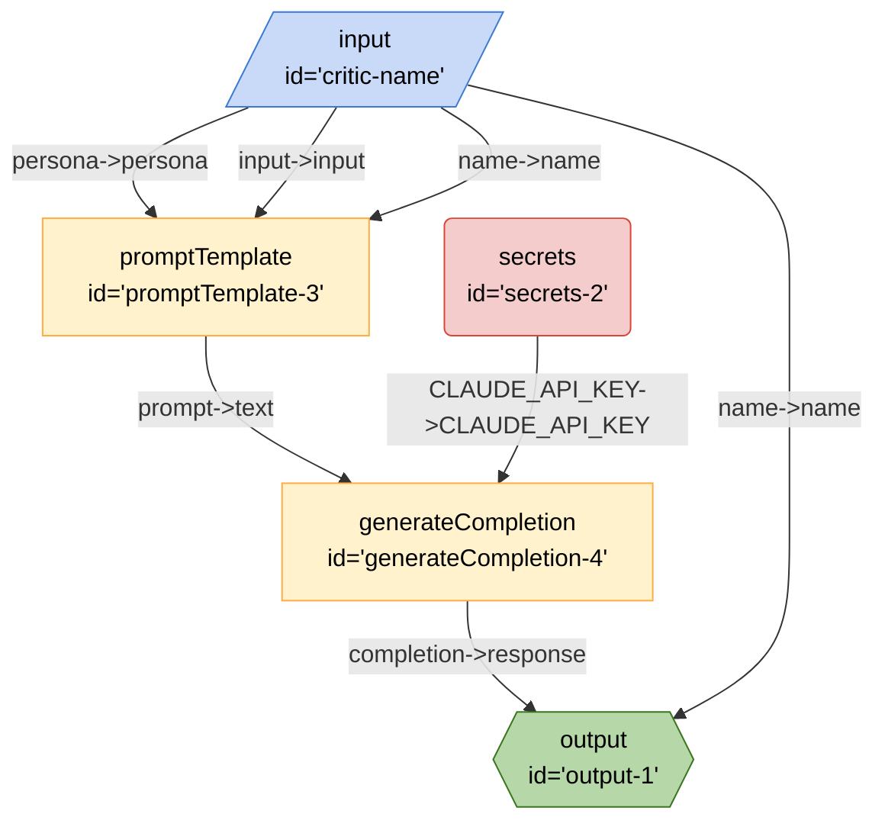

## critic.ts

```mermaid
%%{init: 'themeVariables': { 'fontFamily': 'Fira Code, monospace' }}%%
graph TD;
criticname[/"input <br> id='critic-name'"/]:::input -- "persona->persona" --> promptTemplate3["promptTemplate <br> id='promptTemplate-3'"]
criticname[/"input <br> id='critic-name'"/]:::input -- "input->input" --> promptTemplate3["promptTemplate <br> id='promptTemplate-3'"]
criticname[/"input <br> id='critic-name'"/]:::input -- "name->name" --> promptTemplate3["promptTemplate <br> id='promptTemplate-3'"]
promptTemplate3["promptTemplate <br> id='promptTemplate-3'"] -- "prompt->text" --> generateCompletion4["generateCompletion <br> id='generateCompletion-4'"]
secrets2("secrets <br> id='secrets-2'"):::secrets -- "CLAUDE_API_KEY->CLAUDE_API_KEY" --> generateCompletion4["generateCompletion <br> id='generateCompletion-4'"]
generateCompletion4["generateCompletion <br> id='generateCompletion-4'"] -- "completion->response" --> output1{{"output <br> id='output-1'"}}:::output
criticname[/"input <br> id='critic-name'"/]:::input -- "name->name" --> output1{{"output <br> id='output-1'"}}:::output
classDef default stroke:#ffab40,fill:#fff2ccff,color:#000
classDef input stroke:#3c78d8,fill:#c9daf8ff,color:#000
classDef output stroke:#38761d,fill:#b6d7a8ff,color:#000
classDef passthrough stroke:#a64d79,fill:#ead1dcff,color:#000
classDef slot stroke:#a64d79,fill:#ead1dcff,color:#000
classDef config stroke:#a64d79,fill:#ead1dcff,color:#000
classDef secrets stroke:#db4437,fill:#f4cccc,color:#000
classDef slotted stroke:#a64d79
```