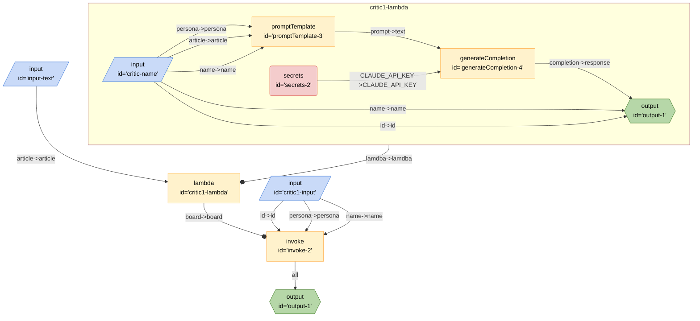

## the-panel.ts

```mermaid
%%{init: 'themeVariables': { 'fontFamily': 'Fira Code, monospace' }}%%
graph TD;
inputtext[/"input <br> id='input-text'"/]:::input -- "article->article" --> critic1lambda["lambda <br> id='critic1-lambda'"]
critic1lambda["lambda <br> id='critic1-lambda'"] -- "board->board" --o invoke2["invoke <br> id='invoke-2'"]
subgraph sg_critic1lambda [critic1-lambda]
critic1lambda_criticname[/"input <br> id='critic-name'"/]:::input -- "persona->persona" --> critic1lambda_promptTemplate3["promptTemplate <br> id='promptTemplate-3'"]
critic1lambda_criticname[/"input <br> id='critic-name'"/]:::input -- "article->article" --> critic1lambda_promptTemplate3["promptTemplate <br> id='promptTemplate-3'"]
critic1lambda_criticname[/"input <br> id='critic-name'"/]:::input -- "name->name" --> critic1lambda_promptTemplate3["promptTemplate <br> id='promptTemplate-3'"]
critic1lambda_promptTemplate3["promptTemplate <br> id='promptTemplate-3'"] -- "prompt->text" --> critic1lambda_generateCompletion4["generateCompletion <br> id='generateCompletion-4'"]
critic1lambda_secrets2("secrets <br> id='secrets-2'"):::secrets -- "CLAUDE_API_KEY->CLAUDE_API_KEY" --> critic1lambda_generateCompletion4["generateCompletion <br> id='generateCompletion-4'"]
critic1lambda_generateCompletion4["generateCompletion <br> id='generateCompletion-4'"] -- "completion->response" --> critic1lambda_output1{{"output <br> id='output-1'"}}:::output
critic1lambda_criticname[/"input <br> id='critic-name'"/]:::input -- "name->name" --> critic1lambda_output1{{"output <br> id='output-1'"}}:::output
critic1lambda_criticname[/"input <br> id='critic-name'"/]:::input -- "id->id" --> critic1lambda_output1{{"output <br> id='output-1'"}}:::output
end
sg_critic1lambda:::slotted -- "lamdba->lamdba" --o critic1lambda

critic1input[/"input <br> id='critic1-input'"/]:::input -- "id->id" --> invoke2["invoke <br> id='invoke-2'"]
critic1input[/"input <br> id='critic1-input'"/]:::input -- "persona->persona" --> invoke2["invoke <br> id='invoke-2'"]
critic1input[/"input <br> id='critic1-input'"/]:::input -- "name->name" --> invoke2["invoke <br> id='invoke-2'"]
invoke2["invoke <br> id='invoke-2'"] -- all --> output1{{"output <br> id='output-1'"}}:::output
classDef default stroke:#ffab40,fill:#fff2ccff,color:#000
classDef input stroke:#3c78d8,fill:#c9daf8ff,color:#000
classDef output stroke:#38761d,fill:#b6d7a8ff,color:#000
classDef passthrough stroke:#a64d79,fill:#ead1dcff,color:#000
classDef slot stroke:#a64d79,fill:#ead1dcff,color:#000
classDef config stroke:#a64d79,fill:#ead1dcff,color:#000
classDef secrets stroke:#db4437,fill:#f4cccc,color:#000
classDef slotted stroke:#a64d79
```