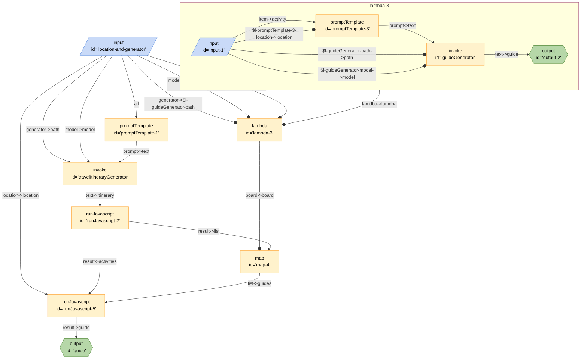

## tour-guide-writer-2.ts

```mermaid
%%{init: 'themeVariables': { 'fontFamily': 'Fira Code, monospace' }}%%
graph TD;
locationandgenerator[/"input <br> id='location-and-generator'"/]:::input -- "generator->path" --> travelItineraryGenerator["invoke <br> id='travelItineraryGenerator'"]
locationandgenerator[/"input <br> id='location-and-generator'"/]:::input -- "model->model" --> travelItineraryGenerator["invoke <br> id='travelItineraryGenerator'"]
locationandgenerator[/"input <br> id='location-and-generator'"/]:::input -- "generator->$l-guideGenerator-path" --o lambda3["lambda <br> id='lambda-3'"]
locationandgenerator[/"input <br> id='location-and-generator'"/]:::input -- "model->$l-guideGenerator-model" --o lambda3["lambda <br> id='lambda-3'"]
locationandgenerator[/"input <br> id='location-and-generator'"/]:::input -- "location->$l-promptTemplate-3-location" --o lambda3["lambda <br> id='lambda-3'"]
lambda3["lambda <br> id='lambda-3'"] -- "board->board" --o map4["map <br> id='map-4'"]
subgraph sg_lambda3 [lambda-3]
lambda3_guideGenerator["invoke <br> id='guideGenerator'"] -- "text->guide" --> lambda3_output2{{"output <br> id='output-2'"}}:::output
lambda3_promptTemplate3["promptTemplate <br> id='promptTemplate-3'"] -- "prompt->text" --> lambda3_guideGenerator["invoke <br> id='guideGenerator'"]
lambda3_input1[/"input <br> id='input-1'"/]:::input -- "item->activity" --> lambda3_promptTemplate3["promptTemplate <br> id='promptTemplate-3'"]
lambda3_input1[/"input <br> id='input-1'"/]:::input -- "$l-guideGenerator-path->path" --o lambda3_guideGenerator["invoke <br> id='guideGenerator'"]
lambda3_input1[/"input <br> id='input-1'"/]:::input -- "$l-guideGenerator-model->model" --o lambda3_guideGenerator["invoke <br> id='guideGenerator'"]
lambda3_input1[/"input <br> id='input-1'"/]:::input -- "$l-promptTemplate-3-location->location" --o lambda3_promptTemplate3["promptTemplate <br> id='promptTemplate-3'"]
end
sg_lambda3:::slotted -- "lamdba->lamdba" --o lambda3

runJavascript5["runJavascript <br> id='runJavascript-5'"] -- "result->guide" --> guide{{"output <br> id='guide'"}}:::output
locationandgenerator[/"input <br> id='location-and-generator'"/]:::input -- "location->location" --> runJavascript5["runJavascript <br> id='runJavascript-5'"]
runJavascript2["runJavascript <br> id='runJavascript-2'"] -- "result->activities" --> runJavascript5["runJavascript <br> id='runJavascript-5'"]
map4["map <br> id='map-4'"] -- "list->guides" --> runJavascript5["runJavascript <br> id='runJavascript-5'"]
runJavascript2["runJavascript <br> id='runJavascript-2'"] -- "result->list" --> map4["map <br> id='map-4'"]
travelItineraryGenerator["invoke <br> id='travelItineraryGenerator'"] -- "text->itinerary" --> runJavascript2["runJavascript <br> id='runJavascript-2'"]
promptTemplate1["promptTemplate <br> id='promptTemplate-1'"] -- "prompt->text" --> travelItineraryGenerator["invoke <br> id='travelItineraryGenerator'"]
locationandgenerator[/"input <br> id='location-and-generator'"/]:::input -- all --> promptTemplate1["promptTemplate <br> id='promptTemplate-1'"]
classDef default stroke:#ffab40,fill:#fff2ccff,color:#000
classDef input stroke:#3c78d8,fill:#c9daf8ff,color:#000
classDef output stroke:#38761d,fill:#b6d7a8ff,color:#000
classDef passthrough stroke:#a64d79,fill:#ead1dcff,color:#000
classDef slot stroke:#a64d79,fill:#ead1dcff,color:#000
classDef config stroke:#a64d79,fill:#ead1dcff,color:#000
classDef secrets stroke:#db4437,fill:#f4cccc,color:#000
classDef slotted stroke:#a64d79
```